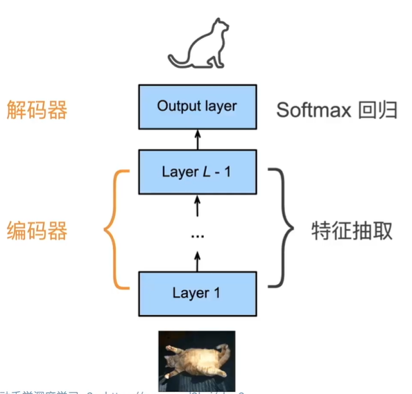

# 学习报告5

| 姓名 | 林鑫 | 学号 | 2405030219 | 日期 | 2026.3.22 |
| :--- | :--- | :--- | :--- | :--- | :--- |

**学习内容：** 计算机视觉

---

### 概要：
多层感知机的简单实现（代码）

---
### 编码器-解码器
从CNN看：编码器是将输入编程成一个中间表达形式（特征）；解码器主要就是把这种表达形式（特征）解码成一个具体的标签（分类）。

